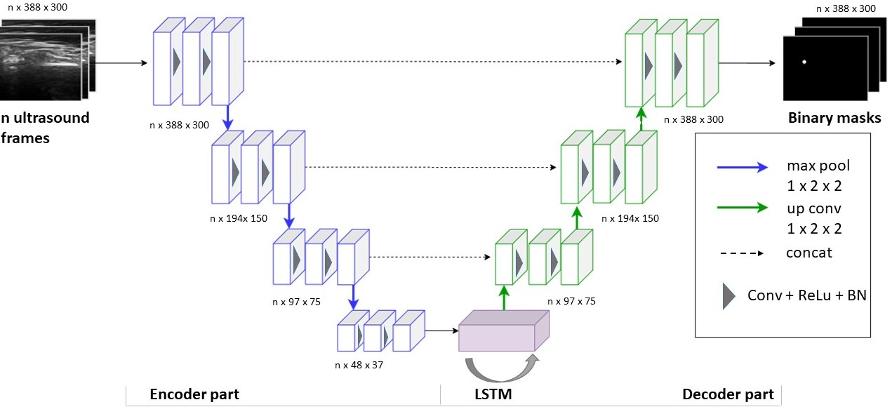
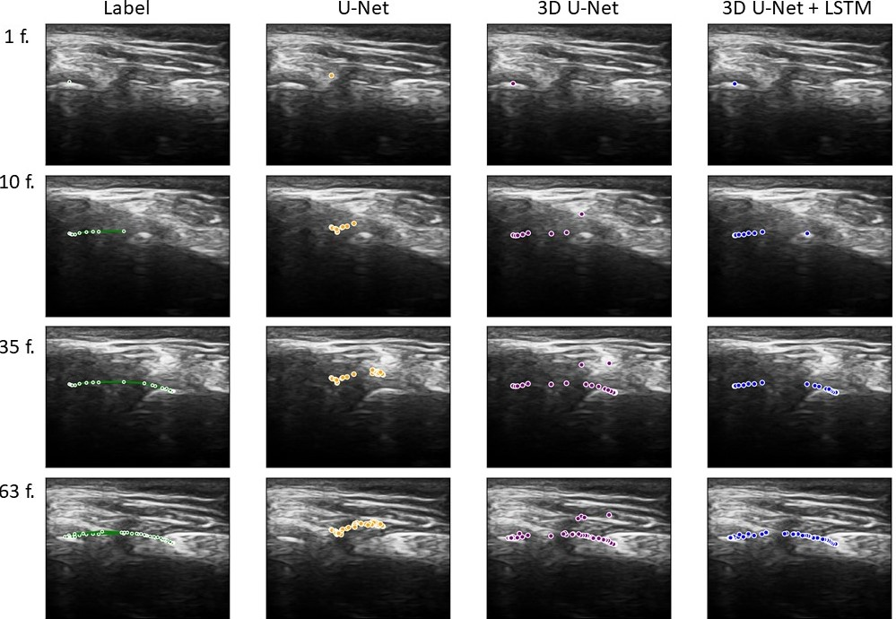

# TMJ_tracking
This is the official submission repository for "Deep learning for spatio-temporal localization of temporomandibular joint in ultrasound videos".

Accurate interpretation of images of complex joints, such as the temporomandibular joint (TMJ), has become essential in a variety of clinical practices, ranging from the basic assessment of wear and tear (e.g., osteoarthritis) to intricate surgical interventions (e.g., arthroplasty). As of today, this examination routine remains subjective, time-consuming and requires comprehensive understanding of joint properties. Ultrasound (US) diagnostics is the main medical imaging modality that, in addition to its many advantages, allows to assess the condition of the joint during its physiological movements.
An automatic and effective computer-aided diagnosis method to for joint tracking in ultrasound video is highly desirable to facilitate the monotonous part of medical practitioners' work and provide a more objective assessment of the joint condition.
To address the problem of landmark detection, we propose a method that employs modified 3D U-Net which extracts spatial patterns with abstract features, combined with Long
Short-Term Memory (LSTM) modules for processing data as temporal 2D sequences of video frames. The method was evaluated on the prepared US dataset with 13 sequences of TMJ tracking during opening and closing movements of the lower jaw and it demonstrated promising results in comparison with current state-of-the-art medical practice.

<p align="center">


</p>
<p >
<em>Fig. 1. 3D U-Net+LSTM architecture for landmark tracking. LSTM unit is applied to the encoded features of the input frames. The output of the LSTM module then decoded through an upsampling path to get a binary mask with a landmark location.</em>
</p>

## Requirements

To install requirements:

```setup
pip install -r requirements.txt
```
## Training

To train the models used in the paper, run this command:

```train
python train.py
```

See config.yaml - a configuration file, for example how to specify all aspects of the training procedure.

## Pre-trained Models

You can download pretrained model here:
- Pre-trained 3D-UNet + LSTM model for landmark tracking on US video: https://drive.google.com/drive/folders/1DWb84ZMZTtZQ-3i8nT0RZSiDNde8FerZ?usp=sharing

## Evaluation

To evaluate models, run:

```eval
python eval.py 
```

## Results
Here are the visual results of joint tracking for chosen architectures: U-Net, 3D U-Net, and 3D U-Net + LSTM. 
From top to bottom outputs for several frames (first frame, 2 intermediate frames and last frame in the video). For this sample, it is seen that U-Net choses a wrong point for tracking from the beginning, while 3D Unet and 3D U-Net + LSTM chose the right point.
3D U-Net was quite good in its predictions, but made several mistakes during the path and 3D U-Net enhanced with LSTM made very accurate predictions.
On this frame it is seen that 3D U-Net + LSTM made a more accurate prediction than the manual label (the leftmost blue point (prediction) is located directly on the head of the jaw, while the green point (annotation) is not). It’s example of annotation mistake. It confirms the significance of the automation technique for joint tracking, making it more objective and accurate. 
<p align="left">


</p>

<p >
<em>Fig. 2. Visual results of the joint tracking for 1 ultrasound sequence represented in several frames: 1, 10, 35, 63 (from top to bottom), obtained with U-Net, 3D U-Net, and 3D U-Net + LSTM architectures.</em>
</p>

<p align="left">


</p>

  
<p >
<em>Tracking results of 3D U-Net + LSTN performance for 1 ultrasound video.  It represents one test video with the ground truth joint trajectory (green), predictions of 3D U-Net + LSTM (blue) and their comparison.</em>
</p>


## Maintainers
Kristina Belikova @krisbell
